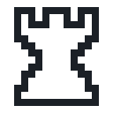
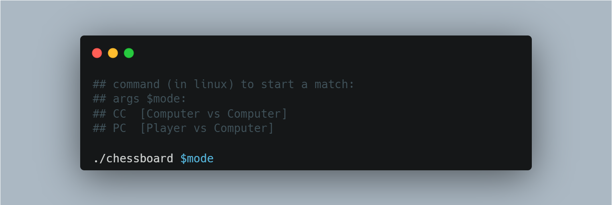
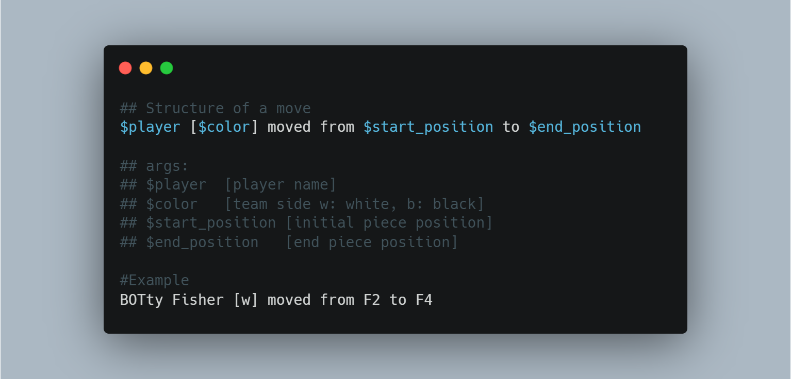
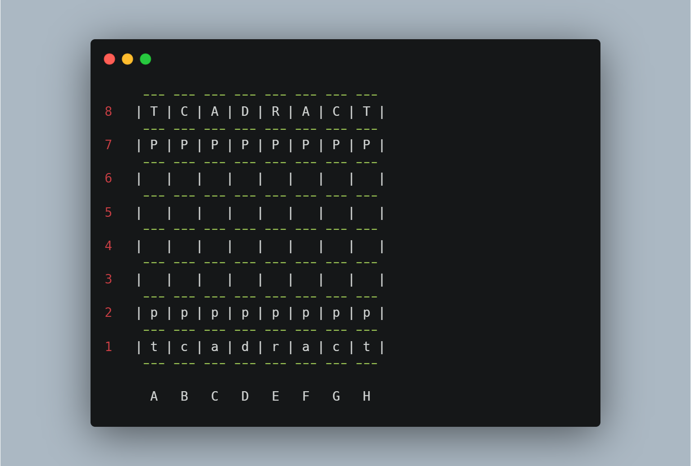
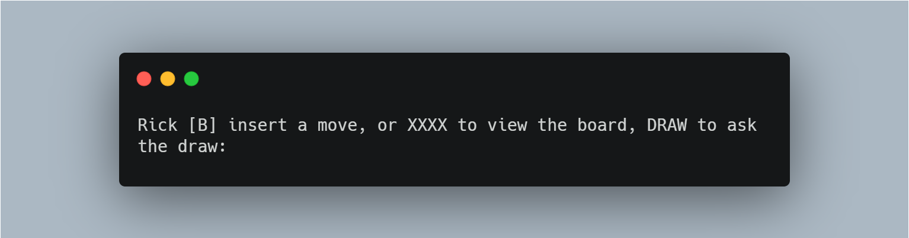
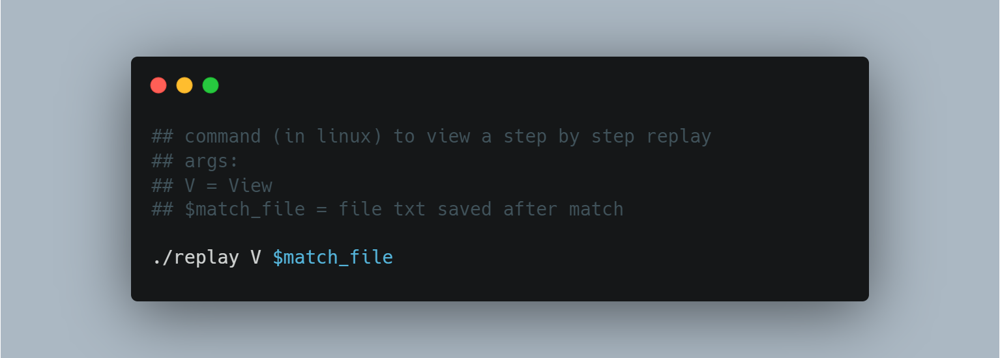

<p align="center">
	
</p>

# CHESS ++


A simple chess game made in C++ for a univesity exam. 

**final result: 10/10**

## Functionality
- 2 play mode 
	- **Computer vs Computer**
	- **Player vs Computer**
- all special moves have been added 
	- en-passant
	- castling
- possibility to **ask for surrender**
- **replay mode**, every match have been saved in .txt file. Two replay mode:
	- **Put replay in file .txt** with all chessboard changes.
	- **Step by Step view** with replay program

## Pieces
>*white pieces are lower case, black pieces are upper case*

List of pieces (the letters are taken from the names of standard Italian pieces):
- **A:** Bishop
- **D:** Queen
- **R:** King
- **T:** Rook
- **C:** Knight
- **P:** Pawn

## Installation (in Linux)
**Note:** CMake is required!

after installation, open folder in shell and write :
```sh 
$ cmake . ##you need root privilege
```
after which, some new files are created in the folder. Now it is necessary to create the dependencies:
```sh 
$ cmake --build . ##you need root privilege
```


## How to Play

First of all, you need to execute the chessboard with the desired mode: 
<p align="center">
	
</p>

if you choose **CC**:
- you need to select the maximum round

if you choose **PC**:
- you need to chose your player name

### it's time to make a move! ♟️

**How to read a move:**

<p align="center">
	
</p>

>what is F2 or F4?

this is the layout of our virtual chessboard:

<p align="center">
	
</p>

>**Note:** white pieces are lower case, black pieces are upper case

- the numbers *[1,8]* are the rows
- the letters *[A,H]* are the  colums

A square coordinates composition is **{letter}{number}**

A move is composition of 2  coordinates **start_position end_position**

When it's your turn, monitor display this message (Rick is my nick 😉):

<p align="center">
	
</p>

**what you can do?**
- **DRAW:** you can request a draw and bot decide if accept o decline
- **XXXX:** print the current status of virtual chessboard
- **Insert a Move:** make your next move in form $start_postion $end_position


## How to Replay
There are 2 mode of  view a match replay
- **Put replay in file .txt** with all chessboard changes 
<p align="center">
	
</p>

- **Step by Step view** with replay program
<p align="center">
	
</p>

## Contrubutors

- [Riccardo Modolo](mailto:riccardo.modolo.1@studenti.unipd.it)
- [Matteo Zanella](mailto:matteo.zanella.3@studenti.unipd.it)
- [Kabir Bertan](mailto:kabir.bertan@studenti.unipd.it)
